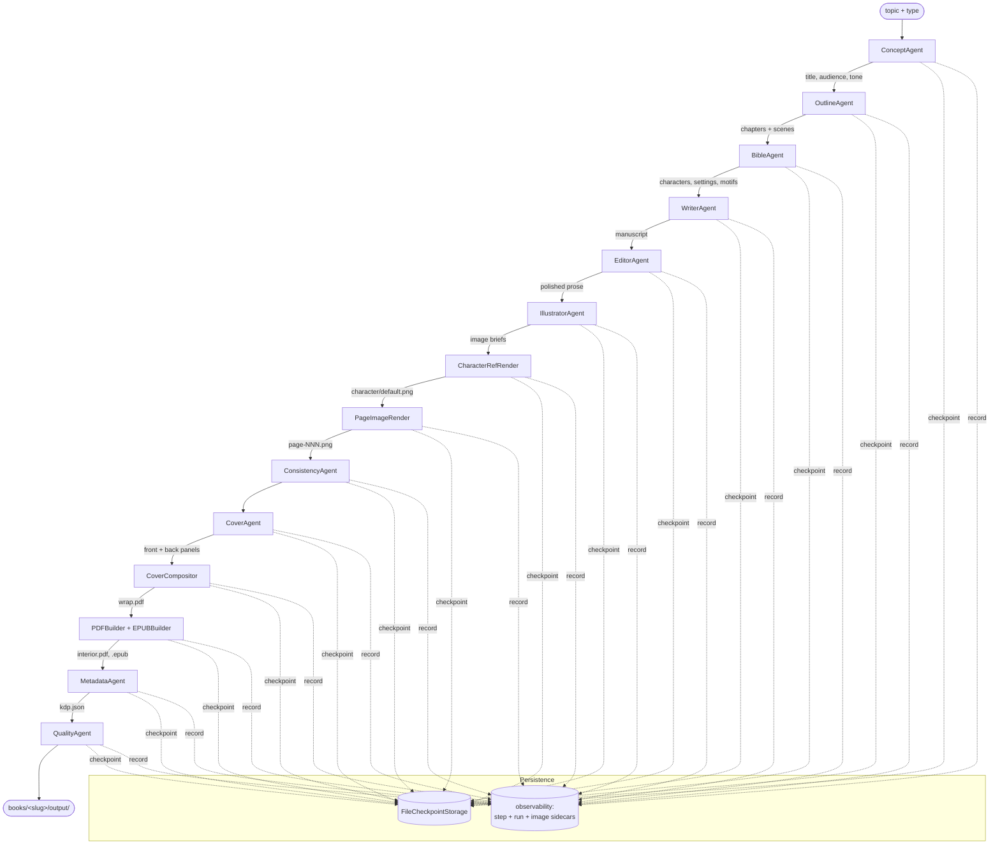
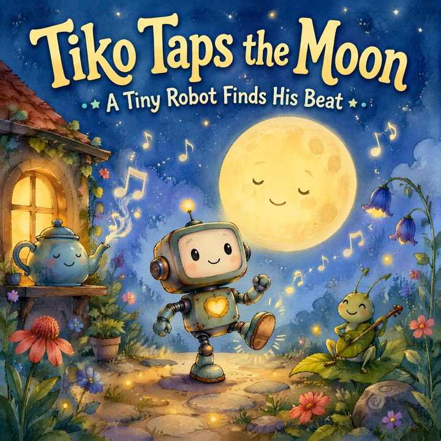
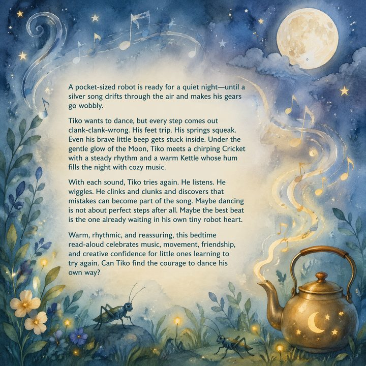
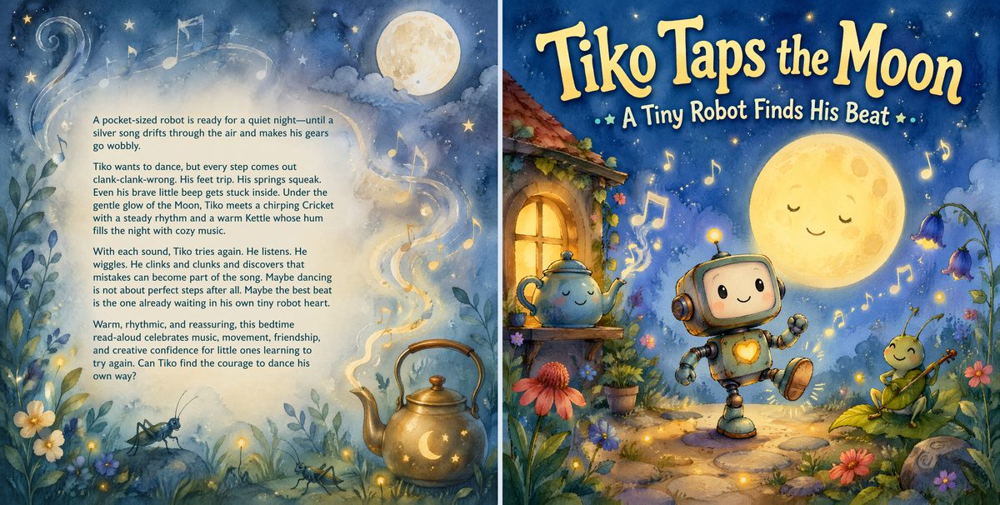
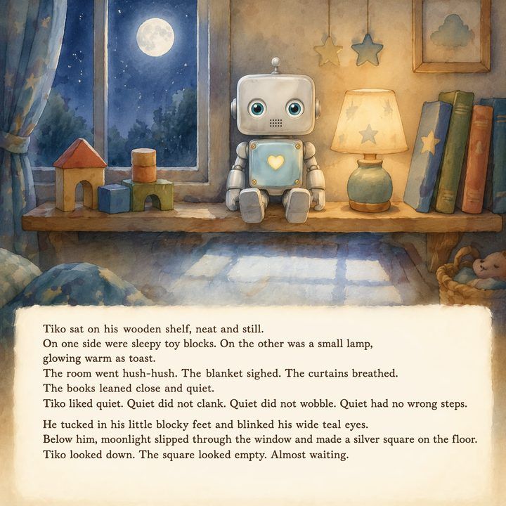
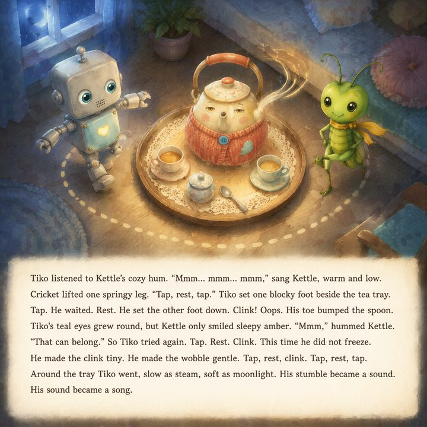

# kdp-book

> One topic in. One KDP-ready book out.

`kdp-book` is a fully-automated Kindle Direct Publishing pipeline built on
**Microsoft Agent Framework 1.2.0**. From a single `--topic` and `--type`
flag it produces a complete, print-ready deliverable: KDP-compliant interior
PDF, full-wrap cover PDF, EPUB, and a `kdp.json` metadata package — with
character-consistent illustrations rendered by `gpt-image-2`.

```bash
kdp-book generate --topic "The boy who loved chocolate"          --type children-picture-book
kdp-book generate --topic "Reincarnated into a world of fantasy" --type light-novel
kdp-book generate --topic "Python for beginners"                 --type non-fiction
kdp-book generate --topic "A detective haunted by her past"      --type fiction-novel
```

The pipeline is **resumable end-to-end**. Crash anywhere — re-run with
`--resume <slug>` and it picks up from the last completed step.

---

## Features

- **Single-command publishing** — concept → outline → bible → manuscript →
  edit → illustrations → cover → PDF + EPUB → KDP metadata → quality review.
- **Microsoft Agent Framework workflow** — every stage is a typed `@step`
  in a `@workflow`, with structured Pydantic state checkpointed after every
  step.
- **Resumable** via `FileCheckpointStorage`. Kill the process at any moment;
  `--resume <slug>` continues from the last successful step.
- **Character consistency** — per-character asset registry with reference
  sheets, ported from the `mangas/` pipeline. Each named character gets its
  own folder and is included as a vision reference on every page render.
- **Text baked into picture-book illustrations** — for
  `children-picture-book`, the page copy is rendered *inside* the artwork by
  `gpt-image-2` with a typography lock (warm cream serif, fixed size, no
  outline) so every page looks like the same book.
- **Full-bleed picture-book PDFs** — each page is one zero-margin, edge-to-
  edge image. Front cover, illustrations, back cover. Zero text operators in
  the PDF for picture books.
- **gpt-image-2 cover generation** with title, subtitle and back-cover blurb
  baked into the front and back panels by the model itself. Spine is
  composed programmatically because it's too narrow for the model.
- **No barcode placeholder** on the back cover — Amazon KDP overprints the
  EAN-13 itself.
- **Full observability** — per-step metadata, per-image sidecars, run-level
  totals (tokens, cost, duration, agents used, models used), structured log
  files per run.
- **Parallel everywhere it matters** — chapter drafting, character refs,
  page illustrations, and cover panels all parallelize via
  `asyncio.gather` + `asyncio.Semaphore`.
- **Four book types out of the box** — `children-picture-book`,
  `light-novel`, `non-fiction`, `fiction-novel`. Each pinned to a Pydantic
  `BookTypeConfig` (page count, trim, paper, illustrations per chapter).

---

## Architecture



Each node is a `@step` in a Microsoft Agent Framework `@workflow`. State is
a Pydantic `IBookState` checkpointed to disk after every step so any failure
is recoverable.

### Project layout

```
kdp_book/
├── agents/         concept, outline, bible, writer, editor, illustrator,
│                   cover, metadata, quality
├── tools/          image_client, image_gen, asset_registry, prompt_builder
├── formats/        pdf_interior, epub_builder, cover_compositor,
│                   cover_geometry
├── models/         book.py, assets.py (all Pydantic v2)
├── workflow/       pipeline.py (@workflow), steps.py (@step bodies),
│                   state.py (checkpoint I/O)
├── observability.py  per-step + per-run metadata, per-image sidecars,
│                     token + cost tracking
├── client.py       OpenAIChatCompletionClient factory (Azure-routed)
├── config.py       Settings (BaseSettings) — reads .env
├── log.py          structured log w/ run-scoped file handler
├── middleware.py   LLM call logging + token tracker
└── cli.py          Click CLI
```

---

## Install

```bash
git clone https://github.com/ShonP/kdp-book.git
cd kdp-book
uv sync
cp .env.example .env   # then fill in your keys
uv run kdp-book --help
```

`uv` (Astral's package manager) is required: <https://docs.astral.sh/uv/>.

### Verify the install

```bash
uv run kdp-book doctor
```

This pings the chat endpoint and the `gpt-image-2` endpoint and reports any
missing config.

---

## Configuration — `.env`

```ini
# Required
AZURE_API_KEY=sk-...
OPENAI_BASE_URL=https://your-azure-endpoint.openai.azure.com/openai/deployments/gpt-5.5/chat/completions?api-version=...
AZURE_IMAGE_ENDPOINT=https://your-azure-endpoint.cognitiveservices.azure.com/openai/deployments/gpt-image-2/images/generations?api-version=2024-02-01

# Optional overrides (with defaults)
MODEL=gpt-5.5
IMAGE_QUALITY=low                # low | medium | high
IMAGE_SIZE=1024x1024             # 1024x1024 | 2048x2048
IMAGE_GENERATION_WORKERS=5       # parallel image renders
CHAPTER_WRITER_WORKERS=6         # parallel chapter drafts
KDP_AUTHOR_NAME=Shon Pazarker
KDP_BOOKS_DIR=books
```

Quality on the CLI (`--quality`) overrides `IMAGE_QUALITY` for a single run.

---

## Quick start

```bash
# Cheap text-only smoke test (no images, ~$0.10)
uv run kdp-book generate --topic "A brave little penguin" \
                         --type children-picture-book --no-images

# Full pipeline (text + character refs + 14 page illustrations + cover)
uv run kdp-book generate --topic "A tiny robot who learned to dance" \
                         --type children-picture-book

# Resume after a crash / interruption
uv run kdp-book generate --topic "A tiny robot who learned to dance" \
                         --type children-picture-book \
                         --resume a-tiny-robot-who-learned-to-dance-children-picture-book-20260504-165505
```

When a run completes you'll find the print-ready package at
`books/<slug>/output/`.

---

## CLI reference

| Command                                       | What it does                                                                |
| --------------------------------------------- | --------------------------------------------------------------------------- |
| `kdp-book doctor`                             | Verify `.env` keys + chat/image endpoints + model availability.             |
| `kdp-book generate --topic ... --type ...`    | Run the entire pipeline. Add `--resume <slug>` to recover.                  |
| `kdp-book outline --topic ... --type ...`     | Concept → outline → bible only. Cheap design pass before committing.        |
| `kdp-book write --from <slug>`                | Draft chapters from saved outline.                                          |
| `kdp-book edit --from <slug>`                 | Re-run the editor pass on existing manuscript.                              |
| `kdp-book illustrate --from <slug>`           | Build the per-scene image briefs (no rendering).                            |
| `kdp-book cover --from <slug>`                | Re-render front + back + spine and recompose the wrap.                      |
| `kdp-book format --from <slug> [--output …]`  | Compile PDF + EPUB. `--output pdf|epub|both`.                              |
| `kdp-book metadata --from <slug>`             | Generate KDP `kdp.json` (title, description, keywords, BISAC, age range).   |
| `kdp-book quality --from <slug>`              | Final review: KDP compliance + originality + vision pass on cover.          |
| `kdp-book step <slug> <step_name> [--force]`  | Re-run a single named step. `--force` clears later checkpoints.             |
| `kdp-book status <slug>`                      | Show per-step status from `run_metadata.json`.                              |

### Examples

```bash
# Design pass only — concept + outline + character bible
uv run kdp-book outline --topic "A girl who whispers to clouds" \
                        --type children-picture-book

# After tweaking the outline by hand, write the chapters
uv run kdp-book write --from a-girl-who-whispers-to-clouds-...

# Re-render only the cover (e.g. after iterating on the cover prompt)
uv run kdp-book cover --from a-girl-who-whispers-to-clouds-...

# Force-rerun a single step (clears later checkpoints to keep state consistent)
uv run kdp-book step a-girl-who-whispers-to-clouds-... images --force

# Cheap end-to-end smoke test (skip every image)
uv run kdp-book generate --topic "Python for absolute beginners" \
                         --type non-fiction --no-images

# Crank quality for the hero project
uv run kdp-book generate --topic "..." --type children-picture-book \
                         --quality high
```

---

## Book types

| Type                    | Pages   | Trim     | Illustrations                    | Notes                                  |
| ----------------------- | ------- | -------- | -------------------------------- | -------------------------------------- |
| `children-picture-book` | 24–32   | 8.5×8.5" | full-page, every scene           | text baked into image, large type      |
| `light-novel`           | 200–300 | 5×8"     | chapter splash + 2 inserts       | manga/anime aesthetic                  |
| `non-fiction`           | 100–200 | 6×9"     | diagrams, code blocks            | citations, references                  |
| `fiction-novel`         | 200–400 | 6×9"     | chapter art only                 | longer-form prose, deeper editing      |

Each type has a `BookTypeConfig` (`models/book.py`) that pins page count,
trim size, paper type, image size, illustrations per chapter, etc. Configs
are swappable — adding a new type is a single Pydantic model.

---

## Output structure

After a successful run:

```
books/<slug>/
├── book.json                # full IBookState — single source of truth
├── concept.json             # ConceptAgent output (title, audience, tone, ...)
├── outline.json             # chapters + scenes
├── bible.json               # characters, settings, motifs, recurring props
├── editor_report.json       # editor scores + notes per chapter
├── manifest.json            # asset registry (characters → variants → paths)
├── chapters/
│   ├── 01-the-quiet-night.md
│   ├── 02-a-silver-song.md
│   └── ...
├── assets/                  # one folder per individual character
│   ├── tiko/
│   │   ├── default.png
│   │   ├── default.png.json # sidecar: prompt, refs, retries, model
│   │   └── variants/
│   │       └── side.png
│   ├── moon/
│   ├── cricket/
│   └── kettle/
├── images/                  # page illustrations (text baked in for picture books)
│   ├── page-001.png
│   ├── page-001.png.json    # per-image sidecar
│   ├── page-002.png
│   └── ...
├── cover/
│   ├── front.png            # gpt-image-2 front (with title baked in)
│   ├── front.png.json
│   ├── back.png             # gpt-image-2 back (with blurb baked in)
│   ├── back.png.json
│   ├── wrap.png             # composed full wrap (back + spine + front)
│   └── wrap.pdf
├── metadata/                # one JSON per @step
│   ├── 01-concept.json
│   ├── 02-outline.json
│   └── ...
├── logs/
│   └── run-<pid>.log        # structured log for the run
├── run_metadata.json        # run totals: tokens, cost, status per step
└── output/                  # the KDP-ready package
    ├── interior.pdf
    ├── interior.epub
    ├── cover.pdf
    └── kdp.json
```

`output/` is the whole deliverable — drop it into KDP's "Add a new title"
flow.

---

## Character consistency

Ported from the `mangas/` repo. The flow:

1. **BibleAgent** produces a structured `BookBible` with one entry per
   *individual* character (`Tiko`, `Luna`, `Captain Finn`). Plurals/groups
   ("Children", "Young Dragons", "The Villagers") are forbidden by prompt
   and filtered post-hoc.
2. **CharacterRefRender** renders one **default sheet per character** with
   `gpt-image-2`. Each character lives in its own directory:

   ```
   books/<slug>/assets/
   ├── tiko/
   │   ├── default.png
   │   ├── default.png.json
   │   └── variants/
   │       └── side.png
   └── luna/
       ├── default.png
       └── variants/
           └── running.png
   ```
3. **PageImageRender** renders each page using `gpt-image-2`'s edit-with-
   refs mode. For every named character that appears in the scene, the
   renderer resolves the right variant from the registry and includes it
   as a vision reference, so "Tiko" looks like Tiko in every panel.
4. **AssetRegistry** keeps a `manifest.json` mapping character → variants →
   on-disk paths. Variants can chain (`angry` derived from `default`) and be
   marked `stale` when a parent variant is regenerated.

Reference sheets and page renders all save sidecar JSONs (prompt, refs
used, model, retry count, safety filter hits, generation time).

---

## Resumability

State is checkpointed by Microsoft Agent Framework's
`FileCheckpointStorage`. After every `@step` succeeds, the full
`IBookState` is serialized to `books/<slug>/checkpoints/`. To resume:

```bash
uv run kdp-book generate --topic "..." --type children-picture-book \
                         --resume <slug>
```

The workflow loads the latest checkpoint and skips every step whose output
already exists. To force re-run a specific step:

```bash
uv run kdp-book step <slug> <step_name> --force
```

`--force` invalidates downstream checkpoints so the rerun stays consistent.

---

## Parallelism

`asyncio.gather` + `asyncio.Semaphore` parallelize the slow steps:

| Step                    | Pool size              | Knob                       |
| ----------------------- | ---------------------- | -------------------------- |
| Chapter drafting        | 6 (default)            | `CHAPTER_WRITER_WORKERS`   |
| Character ref sheets    | 5 (default)            | `IMAGE_GENERATION_WORKERS` |
| Page illustrations      | 5 (default)            | `IMAGE_GENERATION_WORKERS` |
| Illustration brief gen  | `CHAPTER_WRITER_WORKERS` | (shares the same pool)   |
| Cover panels            | 3 (front + back fixed) | hardcoded                  |

Set workers to `1` for strict sequential runs. Live numbers from the robot
test book (14 pages, 4 characters):

| Step      | Sequential | Parallel (5/6 workers) |
| --------- | ---------- | ---------------------- |
| Write     | 49.8 s     | **21.2 s**             |
| Illustrate| 44.5 s     | **9.2 s**              |
| Images    | 304 s      | **160 s**              |

---

## Cost estimates

Defaults: `gpt-5.5` ($5/M input + $15/M output) and `gpt-image-2` at
`quality=low`, `1024×1024`.

| Type                    | Tokens (text) | Images                              | Approx. cost |
| ----------------------- | ------------- | ----------------------------------- | ------------ |
| `children-picture-book` | ~80k          | 4 chars + 14 pages + cover (3 panels) | **~$2.00**   |
| `light-novel`           | ~600k         | 8 chars + 30 inserts + cover          | **~$10.00**  |
| `non-fiction`           | ~250k         | cover + diagrams (text-mostly)        | **~$3.00**   |
| `fiction-novel`         | ~700k         | 6 chars + 12 chapter art + cover      | **~$8.00**   |

Bumping `--quality high` ~4× the image cost. `--no-images` strips ~80% of
the bill.

> **Live measurement** from the latest robot picture book run:
> 14 chapters, 14 illustrations, 4 character refs, full wrap cover —
> **73,262 tokens / $0.55** for *all text* (concept, outline, bible, 14
> chapters, edit pass, illustration briefs, metadata, quality review).
> Image cost on top depends on quality.

---

## Observability

Every run emits three layers of metadata:

### 1. Per-step — `books/<slug>/metadata/NN-<step>.json`

```jsonc
{
  "step_name": "write",
  "started_at": "...",
  "completed_at": "...",
  "duration_seconds": 21.2,
  "tokens": { "prompt": 18234, "completion": 12011, "total": 30245 },
  "estimated_cost_usd": 0.27,
  "model": "gpt-5.5",
  "agent": "writer-agent",
  "retry_count": 0,
  "prompts": [ /* full text of every LLM call */ ],
  "outputs": [ /* every structured response */ ],
  "errors": null
}
```

### 2. Per-image — `<image>.png.json` next to every PNG

```jsonc
{
  "image_path": "images/page-001.png",
  "prompt": "Children's picture book page in soft watercolor...",
  "references": ["assets/tiko/default.png", "assets/cricket/default.png"],
  "model": "gpt-image-2",
  "size": "1024x1024",
  "quality": "low",
  "retry_count": 0,
  "safety_filter_hits": 0,
  "generation_time_seconds": 11.4
}
```

### 3. Per-run — `books/<slug>/run_metadata.json`

```jsonc
{
  "run_id": "...",
  "slug": "a-tiny-robot-who-learned-to-dance-...",
  "topic": "A tiny robot who learned to dance",
  "book_type": "children-picture-book",
  "tokens": { "prompt": 55261, "completion": 18001, "total": 73262 },
  "estimated_cost_usd": 0.55,
  "agents_used": ["concept-agent", "outline-agent", ...],
  "models_used": ["gpt-5.5"],
  "steps": [ { "step_name": "outline", "status": "ok", "duration_seconds": ... }, ... ]
}
```

A run-scoped log handler also writes `books/<slug>/logs/run-<pid>.log` with
full stack traces on any error.

---

## Screenshots

All sample images below were produced by a real `kdp-book` run (children
picture book, `quality=low`). Source: `books/<slug>/...`.

### Cover (gpt-image-2, title and blurb baked in)

| Front                                              | Back                                              |
| -------------------------------------------------- | ------------------------------------------------- |
|    |     |

Full wrap (back + spine + front), composed at 300 DPI for KDP:



### Page illustrations (text baked into the image)

| Page 1                                            | Page 7                                            |
| ------------------------------------------------- | ------------------------------------------------- |
|           |           |

The font, color and weight are locked in the prompt so all 14 pages share
the same typography.

### Character reference sheet


The protagonist's `default.png` — used as a vision reference on every page
render to keep him visually identical across the book.

---

## License

Private. © Shon Pazarker.
